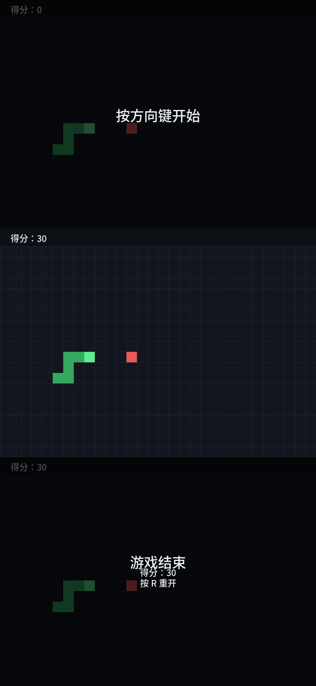

# 贪吃蛇 Snake（Python + pygame）

一个结构清晰、核心逻辑可单元测试的贪吃蛇小游戏。



## 安装依赖

```bash
python -m venv .venv
source .venv/bin/activate      # Windows: .venv\Scripts\activate
pip install -r requirements.txt
```

## 启动

```bash
python main.py
```

## 操作说明

| 按键 | 作用 |
| --- | --- |
| ↑ ↓ ← → / W A S D | 转向（开局、禁止 180° 掉头） |
| 空格 / P | 暂停 / 继续 |
| R | 重新开始 |
| Esc / 关闭窗口 | 退出 |

## 目录结构

```
main.py          程序入口与主循环
game/            核心逻辑（不依赖 pygame，可无头测试）
  config.py      全局常量
  direction.py   Direction / Action 枚举
  snake.py       蛇身数据结构与行为
  food.py        食物生成
  core.py        状态机与单步推进
ui/              表现层（唯一使用 pygame 的地方）
  renderer.py    渲染
  input_handler.py  输入处理
tests/           unittest 单元测试
docs/            项目计划文档
```

## 运行测试

```bash
python -m unittest discover -s tests -v
```

详细设计见 [docs/PROJECT_PLAN.md](docs/PROJECT_PLAN.md)。
